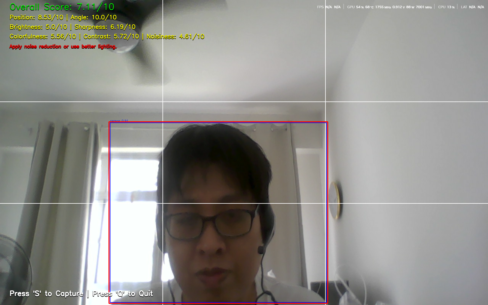

# AI Guided Camera



## Introduction
AiMeiMei Camera is an AI-powered photo evaluation tool designed to help users take better pictures in real-time. This project combines state-of-the-art computer vision models and custom heuristics to analyze and provide feedback on individual image quality factors.

The system evaluates each photo using:

📐 YOLO for object detection and position scoring (to assess subject framing).

🧠 SPAQ (Single-Image Photo Aesthetic Quality) deep model to evaluate image attributes like brightness, colorfulness, contrast, sharpness, and noise.

🔄 OpenCV-based angle estimation to compute tilt and perspective distortion.

📊 A scoring module that calculates individual sub-scores and a final composite score, offering real-time feedback and suggestions (e.g., "Move camera left", "Increase brightness", "Re-center subject").

AiMeiMei is ideal for photography learners, tourism guide apps, or any system where visual quality matters. The tool is designed to run efficiently and provide both qualitative scores and actionable insights.

## Installation

To get started, first install the required dependencies:

```bash
pip install torch torchvision torchaudio --index-url https://download.pytorch.org/whl/cu126
pip install opencv-python numpy ultralytics 
```

## Model Files
Download necessary AI model files from the following link:

[📥 Download Models](https://drive.google.com/file/d/1FO4ATC3l8Nfq-KXi0yXQfv8IAKvFJpX9/view?usp=sharing)

Extract and place only MT-A_release.pt model to project folder

## GPU Support
This application requires GPU support for optimal performance, especially for:
- **torch**

Ensure your environment supports CUDA before installation.

## Features
- Real-time guidance and suggestions for improving photo quality using **SPAQ** and position with **Yolo**(e.g., optimal positioning of the main subject) 

## Credit
- [SPAQ](https://github.com/h4nwei/SPAQ)
- [Yolo](https://github.com/ultralytics/ultralytics)


